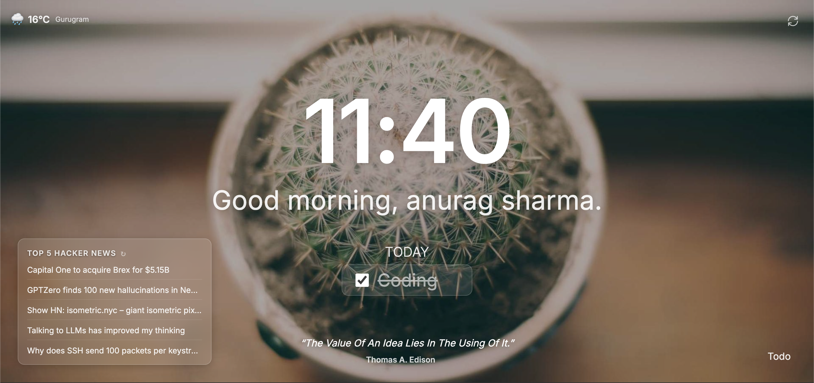

# Focus Start

**Focus Start** is a serene, beautiful personal dashboard that replaces your new tab page. It is designed to help you calm your mind, sharpen your focus, and stay organized throughout the day.

## Features

- **Daily Focus**: Set your main intention for the day and check it off when accomplished.
- **Inspirational Quotes**: Get a fresh dose of motivation with a new quote every day.
- **Dynamic Wallpapers**: Enjoy breathtaking, high-quality landscapes that refresh daily.
- **To-Do List**: A simple, unobtrusive todo list to keep track of your tasks.
- **Smart Greeting**: Personalized greeting based on the time of day and your name.
- **Privacy First**: All your data (name, todos, focus) is stored locally on your device.

## Installation

### For Users (Chrome Web Store)

1. Visit the **Focus Start** page on the Chrome Web Store (Link coming soon!).
2. Click **Add to Chrome**.
3. Open a new tab to see your new dashboard!

### For Developers (Manual Installation)

1. Clone or download this repository.
2. Open Chrome and navigate to `chrome://extensions/`.
3. Toggle **Developer mode** in the top right corner.
4. Click **Load unpacked**.
5. Select the folder where you downloaded this project (the folder containing `manifest.json`).
6. Open a new tab to test it out.

## Tech Stack

- **HTML5 & CSS3** (Vanilla, optimized for performance)
- **JavaScript** (ES6+, Service Workers for API handling)
- **APIs**:
  - [Picsum Photos](https://picsum.photos) (Wallpapers)
  - [DummyJSON](https://dummyjson.com) (Quotes)

## Privacy

Focus Start is committed to your privacy. content for the dashboard.

- **No Tracking**: We do not collect any personal data.
- **Local Storage**: Your preferences and tasks are saved only on your browser.
- **Safe**: No external analytics or ad trackers.
